### Hi there 👋

My name is Arnaud Duforat and I'm a Solution Architect from France.

You can find some of my projects on [dema.in](https://dema.in) and my articles on my blog at [blog.dema.in](https://blog.dema.in)

## &#x1f4c8; GitHub Stats

## 🤝 Some of my Open Source contributions

Project                                                                                      | Language | Year | List of contributions
---------------------------------------------------------------------------------------------|----------|------|----------------------
[RAN3D/spray-wrtc](https://github.com/RAN3D/spray-wrtc)                                      | JS       | 2017 | [(add UTs) list >>>](https://github.com/RAN3D/spray-wrtc/commits?author=neokeld)
[DefinitelyTyped/DefinitelyTyped](https://github.com/DefinitelyTyped/DefinitelyTyped)        | JS       | 2018 | [(fix bug) list >>>](https://github.com/DefinitelyTyped/DefinitelyTyped/commits?author=neokeld)
[spring-cloud/spring-cloud-function](https://github.com/spring-cloud/spring-cloud-function)  | Java     | 2019 | [(simple refactor) list >>>](https://github.com/spring-cloud/spring-cloud-function/commits?author=neokeld)
[TechEmpower/FrameworkBenchmarks](https://github.com/TechEmpower/FrameworkBenchmarks)        | Rust     | 2019 | [(fix perf test) list >>>](https://github.com/TechEmpower/FrameworkBenchmarks/commits?author=neokeld)
[webpack-contrib/eslint-loader](https://github.com/webpack-contrib/eslint-loader)            | JS       | 2020 | [(fix sec vuln) list >>>](https://github.com/webpack-contrib/eslint-loader/commits?author=neokeld)
[HeapsIO/heaps](https://github.com/HeapsIO/heaps)                                            | Haxe     | 2020 | [(evol API/add ex) list >>>](https://github.com/HeapsIO/heaps/commits?author=neokeld)
[Requarks/wiki](https://github.com/Requarks/wiki)                                            | JS       | 2020 | [(fix bug) list >>>](https://github.com/Requarks/wiki/commits?author=neokeld)
[grommet/grommet](https://github.com/grommet/grommet)                                        | JS       | 2020 | [(fix doc) list >>>](https://github.com/grommet/grommet/commits?author=neokeld)
[devopsfaith/krakend-jose](https://github.com/devopsfaith/krakend-jose)                      | Go       | 2020 | [(fix vuln) list >>>](https://github.com/devopsfaith/krakend-jose/commits?author=neokeld)
[devopsfaith/krakendesigner](https://github.com/devopsfaith/krakendesigner)                  | Go       | 2020 | [(fix typo) list >>>](https://github.com/devopsfaith/krakendesigner/commits?author=neokeld)
[devopsfaith/krakend](https://github.com/devopsfaith/krakend)                                | Go       | 2020 | [(fix typo) list >>>](https://github.com/devopsfaith/krakend/commits?author=neokeld)
[PXshadow/weblink](https://github.com/PXshadow/weblink)                                      | Haxe     | 2021 | [(evol) list >>>](https://github.com/PXshadow/weblink/commits?author=neokeld)
[edukera/archetype-landing](https://github.com/PXshadow/weblink)                             | Archetype | 2021 | [(fix doc) list >>>](https://github.com/edukera/archetype-landing/commits?author=neokeld)
[HeapsIO/heaps-doc](https://github.com/HeapsIO/heaps-doc)                                    | Haxe     | 2022 | [(fix doc) list >>>](https://github.com/HeapsIO/heaps-doc/commits?author=neokeld)
[PXshadow/weblink](https://github.com/PXshadow/weblink)                                      | Haxe     | 2022 | [(evol) list >>>](https://github.com/PXshadow/weblink/commits?author=neokeld)
[spring-cloud/spring-cloud-function](https://github.com/spring-cloud/spring-cloud-function)  | Java     | 2022 | [(refacto) list >>>](https://github.com/spring-cloud/spring-cloud-function/commits?author=neokeld)
[jhipster/consul-config-loader](https://github.com/jhipster/consul-config-loader)            | Docker   | 2023 | [(refacto) list >>>](https://github.com/jhipster/consul-config-loader/commits?author=neokeld)
[josuigoa/hl-extension](https://github.com/josuigoa/hl-extension)                            | Haxe     | 2024 | [(doc) list >>>](https://github.com/josuigoa/hl-extension/commits?author=neokeld)
[c3lang/c3c](https://github.com/c3lang/c3c)                                                  | C3       | 2024 | [(evol) list >>>](https://github.com/c3lang/c3c/commits?author=neokeld&since=2024-01-01&until=2024-12-31)
[tsoding/c3ws](https://github.com/tsoding/c3ws)                                              | C3       | 2024 | [(evol) list >>>](https://github.com/tsoding/c3ws/commits?author=neokeld)
[tclesius/http.c3](https://github.com/tclesius/http.c3)                                      | C3       | 2024 | [(evol) list >>>](https://github.com/tclesius/http.c3/commits?author=neokeld)
[c3lang/c3c](https://github.com/c3lang/c3c)                                                  | C3       | 2026 | [(evol) list >>>](https://github.com/c3lang/c3c/commits?author=neokeld&since=2026-01-01&until=2026-12-31)
[c3lang/c3-web](https://github.com/c3lang/c3-web)                                            | C3       | 2026 | [(doc) list >>>](https://github.com/c3lang/c3-web/commits?author=neokeld)
[c3lang/c3-learn](https://github.com/c3lang/c3-learn)                                        | C3       | 2026 | [(doc) list >>>](https://github.com/c3lang/c3-learn/commits?author=neokeld)

## 🏘️ Some of my projets

Project                                                                                      | Year of creation | Links
---------------------------------------------------------------------------------------------|------------------|--------------------------------------------------
News                                                                                         | 2019             | https://news.dema.in/
Carto, add points to your map                                                                | 2019             | https://carto.dema.in/
Citations, a quote collector                                                                 | 2020             | https://citations.dema.in/
JavaFXDesign, a JavaFX application template                                                  | 2020             | https://github.com/neokeld/JavaFXDesign
Transpile Archetype Language to Python                                                       | 2021             | https://github.com/neokeld/archetype-to-python
Composion component library                                                                  | 2021             | https://neokeld.github.io/composion/
Java Fluency Fluent Bit Demo                                                                 | 2022             | https://github.com/neokeld/java-fluency-fluent-bit-demo
Deck GL Bordeaux                                                                             | 2024             | https://dema.in/deck-gl-bordeaux/
Clay with Raylib template                                                                    | 2025             | https://github.com/neokeld/clay-raylib-template
Météo de Mérignac, weather of a french town                                                  | 2025             | https://carto.dema.in/meteo.html
Alexandrie, a bookmarks collector                                                            | 2025             | https://alexandrie.dema.in/
